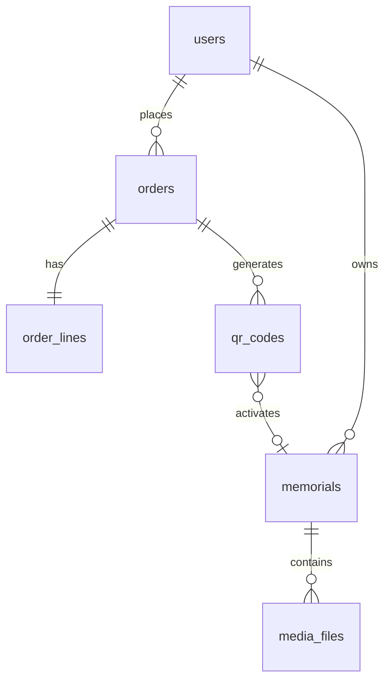

# База данных QR Память

PostgreSQL 16, **3NF**, справочники, триггеры, защита от дубликатов.

**Подробная логика таблиц, примеры данных, юз-кейсы:** **[detal_logic_db.md](detal_logic_db.md)**

**Доступ из backend, SQL-инъекции, процедуры `sp_*`:** **[../docs/DATABASE_ACCESS.md](../docs/DATABASE_ACCESS.md)**

---

## Как работать (DBeaver — основной способ)

Подробная инструкция: **[dbeaver/GUIDE.md](dbeaver/GUIDE.md)**

### Кратко

| Шаг | Что делать | Файл |
|-----|------------|------|
| 1 | Создать БД `qr_pamyat` через GUI DBeaver | — |
| 2 | Подключение к `postgres` → создать роль | `scripts/00_database.sql` |
| 3 | Подключение к `qr_pamyat` → создать таблицы | `scripts/00_full_schema.sql` |
| 4 | Проверить справочники | SQL внизу README |

**Горячие клавиши DBeaver:** Alt+Enter (фрагмент), **Alt+X** (весь скрипт).

### Два варианта шага 3

| Вариант | Когда использовать |
|---------|-------------------|
| **`00_full_schema.sql`** | Быстро, один раз — всё сразу |
| **`01` … `09` по порядку** | Пошагово, если ошибка — видно на каком файле |

---

## psql — только при деплое (опционально)

На VPS без GUI тот же результат:

```bash
psql -U postgres -d qr_pamyat -f db/scripts/00_full_schema.sql
```

Windows: `deploy/apply_schema.ps1`

---

## Файлы в `db/scripts/`

| Файл | Назначение |
|------|------------|
| `00_database.sql` | Роль `qr_app` (подключение к **postgres**) |
| `00_full_schema.sql` | **Вся схема** 01–09 в одном файле (для DBeaver) |
| `01_init.sql` | `pgcrypto`, `citext`, **схема `qr`** |
| `02_lookups.sql` | Справочники |
| `03_users_auth.sql` | Пользователи, токены, согласия (email/телефон, nullable email) |
| `04_commerce.sql` | Заказы, платежи, QR-коды |
| `05_content.sql` | Мемориалы, медиа, отзывы |
| `06_system.sql` | Аудит, идемпотентность |
| `07_logic.sql` | Триггеры `fn_*` и процедуры `sp_*` |
| `08_seed.sql` | Начальные данные (пакеты, статусы, тип `portrait`) |
| `09_grants.sql` | Права `qr_app` (SELECT + EXECUTE sp_*) |
| `99_drop_all.sql` | Сброс схемы (только dev) |

> `00_full_schema.sql` собирается из 01–09. После правки частей пересоберите:
> `db/scripts/build_full_schema.ps1`

---

## Проверка после установки

```sql
SELECT count(*) FROM qr.package_types;   -- 3
SELECT count(*) FROM qr.order_statuses;  -- 6

SELECT table_schema, table_name FROM information_schema.tables
WHERE table_schema = 'qr' ORDER BY 1, 2;
```

---

## ER-диаграмма



---

## 3NF и защита от дубликатов

| Риск | Решение |
|------|---------|
| Два email на один аккаунт | `UNIQUE` на `users.email` (активные) |
| Двойная оплата | Триггер `trg_payments_one_succeeded` |
| Повтор webhook | `UNIQUE` на `payment_webhook_events` |
| Два QR на slug | `UNIQUE (code_slug)` |
| Лимит фото/видео | Триггер `trg_media_files_limits` |
| Гостевой заказ | `orders.user_id` NULL + `fn_link_guest_orders_to_user()` |
| SQL-инъекции | DML только через `sp_*` в схеме **`qr`**, роль `qr_app` без прямого INSERT/UPDATE/DELETE |
| Данные не в public | Все таблицы в схеме **`qr`**, расширения — в `public` |

Полный список — в предыдущих разделах документации и комментариях в SQL.

---

## Пакеты (seed)

| code | Цена | Фото | Видео |
|------|------|------|-------|
| standard | 2990 ₽ | 40 | 0 мин |
| premium | 5990 ₽ | 80 | 20 мин |
| maximum | 11990 ₽ | 200 | 60 мин |

---

## Сброс (dev)

DBeaver → `99_drop_all.sql` → Alt+X → снова `00_full_schema.sql` (удаляется только схема **`qr`**, `public` с расширениями остаётся).

---

## Миграции после деплоя

Начальная схема — SQL в `db/scripts/`. Дальнейшие изменения — **Alembic** в `backend/alembic/`.
