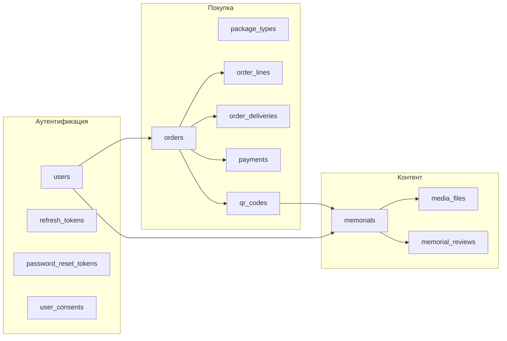
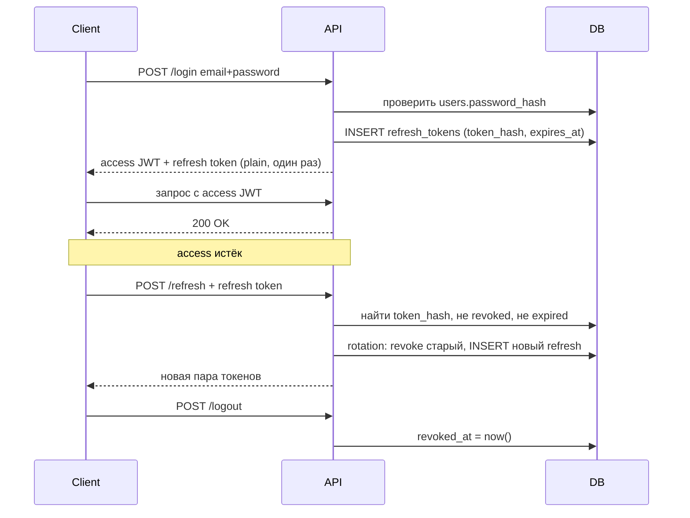

# Подробная логика базы данных QR Память

Документ для разбора **каждой таблицы**: что хранится, примеры строк, юз-кейсы, типы данных и смысл ограничений (`CONSTRAINT`, `INDEX`).

Схема лежит в `db/scripts/`. Начальные данные справочников — в `12_seed.sql`.

---

## Как устроена схема в целом



**Главная идея:** пользователь покупает **пакет** (standard / premium / maximum) → получает **QR-код(ы)** → активирует **мемориальную страницу** с лимитами из пакета. Пакет — не «подписка на аккаунт», а свойство конкретной покупки и привязанного QR.

---

## Имена ограничений: откуда берётся `chk_...`, `uq_...`

PostgreSQL **не генерирует** эти имена сам — их задаём мы в SQL. Префикс — договорённость команды:

| Префикс | Тип | Пример | Смысл |
|---------|-----|--------|-------|
| `chk_` | `CHECK` | `chk_user_consents_actor` | Проверка значений в строке |
| `uq_` | `UNIQUE` | `uq_password_reset_token_hash` | Значение (или комбинация) уникально |
| `fk_` | `FOREIGN KEY` | `fk_qr_codes_memorial` | Ссылка на другую таблицу |
| `idx_` | `INDEX` | `idx_orders_user_id` | Индекс для быстрого поиска |

**Пример:** строка

```sql
CONSTRAINT chk_user_consents_actor CHECK (user_id IS NOT NULL OR email IS NOT NULL)
```

означает: ограничение с **именем** `chk_user_consents_actor`, тип — `CHECK`, правило — «должен быть заполнен `user_id` **или** `email` (хотя бы один)».

**Пример:** `CONSTRAINT uq_password_reset_token_hash UNIQUE (token_hash)` — имя `uq_password_reset_token_hash`, два одинаковых хеша сброса пароля в таблице быть не может.

---

## Типы данных (в т.ч. редкие)

| Тип PostgreSQL | Где используется | Объяснение |
|----------------|------------------|------------|
| `UUID` | `id` почти везде | Случайный 128-битный идентификатор. Генерируется `gen_random_uuid()` (расширение `pgcrypto`). Удобен для API и слияния данных без коллизий. |
| `CITEXT` | `email`, `buyer_email` | Case-Insensitive TEXT. `User@Mail.ru` и `user@mail.ru` — **одно и то же**. Нужен для email без дублей из-за регистра. Расширение `citext` из `01_extensions.sql`. |
| `INET` | `ip_address` | IP-адрес (IPv4/IPv6). PostgreSQL хранит и валидирует формат. |
| `JSONB` | `payload`, `response_body`, аудит | JSON в бинарном виде — для webhook-тел, ответов API, diff в аудите. |
| `TIMESTAMPTZ` | `created_at`, `paid_at`, … | Момент времени **с часовым поясом** (UTC внутри). «Когда произошло» для логов и сроков. |
| `DATE` | `birth_date`, `death_date` | Только дата, без времени. |
| `NUMERIC(12,2)` | цены, суммы | Деньги без ошибок float: до 12 цифр, 2 после запятой (копейки). |
| `CHAR(3)` | `currency` | Ровно 3 символа, напр. `RUB`. |
| `SMALLINT` / `SMALLSERIAL` | `role_id`, справочники | Малые целые. `SMALLSERIAL` — автоинкремент для справочников (1, 2, 3…). |
| `BIGINT` / `BIGSERIAL` | `order_number`, `qr_scan_events.id` | Большие целые; `order_number` — человекочитаемый номер заказа. |
| `TEXT` | длинные тексты | Без лимита длины (адрес, заметки, отзыв). |
| `VARCHAR(n)` | имена, slug, hash | Строка до n символов. |
| `BOOLEAN` | флаги | `TRUE` / `FALSE`. |
| `GENERATED ALWAYS AS IDENTITY` | `order_number` | Автонумерация PostgreSQL (как SERIAL, но современный синтаксис). |

---

## 02_lookups.sql — справочники

Справочники вынесены отдельно (**3NF**): в `orders` хранится `status_id`, а не строка «Ожидает оплаты». Так статусы едины, их можно переименовать в одном месте, и нет опечаток.

Общий шаблон строки справочника:

| Поле | Пример | Смысл |
|------|--------|-------|
| `id` | `1` | Внутренний ключ (его пишем в FK) |
| `code` | `pending_payment` | Стабильный код для backend (`if status.code == 'paid'`) |
| `name` | `Ожидает оплаты` | Текст для UI |
| `is_terminal` | `FALSE` | Только у статусов: финальный ли статус (отмена, возврат — да) |

---

### `user_roles` — роли пользователей

**Зачем:** кто зашёл в систему — покупатель или админ.

| id | code | name |
|----|------|------|
| 1 | buyer | Покупатель |
| 2 | admin | Администратор |

**Юз-кейс:** при регистрации `users.role_id = 1`. Админ создаётся вручную или через seed с `role_id = 2`.

> **Про standard / VIP / premium:** это **не роли**, а **пакеты** (`package_types`). Платный тариф привязан к **заказу → QR → мемориалу**, а не к строке `users`. Один пользователь может купить и «Стандарт», и «Максимум» на разные QR.

---

### `package_types` — каталог пакетов (цены и лимиты)

**Зачем:** единственный источник правды для витрины и лимитов медиа.

| id | code | name | price_rub | max_photos | max_video_seconds | sort_order |
|----|------|------|-----------|------------|-------------------|------------|
| 1 | standard | Стандарт | 2990.00 | 40 | 0 | 1 |
| 2 | premium | Премиум | 5990.00 | 80 | 1200 | 2 |
| 3 | maximum | Максимум | 11990.00 | 200 | 3600 | 3 |

- `max_video_seconds`: 1200 = 20 мин, 3600 = 60 мин.
- При изменении цены в каталоге **старые заказы не ломаются** — в `order_lines` и `memorials` хранится **снимок** лимитов на момент покупки/активации.

---

### `order_statuses` — статус заказа

| id | code | name | is_terminal |
|----|------|------|-------------|
| 1 | draft | Черновик | FALSE |
| 2 | pending_payment | Ожидает оплаты | FALSE |
| 3 | paid | Оплачен | FALSE |
| 4 | fulfilled | Выполнен | TRUE |
| 5 | cancelled | Отменён | TRUE |
| 6 | refunded | Возврат | TRUE |

**Типичный путь:** `draft` → `pending_payment` → `paid` → `fulfilled` (QR выдан, доставка завершена).

---

### `payment_statuses` — статус платежа в ЮKassa

| id | code | name | is_terminal |
|----|------|------|-------------|
| 1 | pending | Создан | FALSE |
| 2 | waiting | Ожидает оплаты | FALSE |
| 3 | succeeded | Успешно | TRUE |
| 4 | cancelled | Отменён | TRUE |
| 5 | failed | Ошибка | TRUE |

Отдельно от статуса **заказа**: заказ может быть `paid`, пока платёж в `waiting`; после webhook — `succeeded`.

---

### `qr_code_statuses` — жизненный цикл QR

| id | code | name |
|----|------|------|
| 1 | generated | Сгенерирован |
| 2 | assigned | Привязан к мемориалу |
| 3 | active | Активен |
| 4 | suspended | Приостановлен |
| 5 | revoked | Отозван |

**Юз-кейс:** после оплаты QR создаётся со статусом `generated`. Пользователь создаёт мемориал → `assigned` → публикует → `active`.

---

### `fulfillment_statuses` — доставка физической плашки

| id | code | name |
|----|------|------|
| 1 | pending | Ожидает отправки |
| 2 | processing | В обработке |
| 3 | shipped | Отправлен |
| 4 | delivered | Доставлен |
| 5 | failed | Не доставлен |

Используется в `order_deliveries.fulfillment_status_id`.

---

### `media_types` — тип файла на мемориале

| id | code | name |
|----|------|------|
| 1 | photo | Фото усопшего |
| 2 | video | Видео усопшего |
| 3 | grave_photo | Фото могилы |

На одном мемориале может быть много `photo`/`video`, но **не более одного** `grave_photo` (триггер в `11_functions_triggers.sql`).

---

### `media_processing_statuses` — обработка файла (превью, транскодинг)

| id | code | name |
|----|------|------|
| 1 | pending | Ожидает обработки |
| 2 | processing | Обрабатывается |
| 3 | ready | Готово |
| 4 | failed | Ошибка |

---

### `review_moderation_statuses` — модерация отзывов

| id | code | name |
|----|------|------|
| 1 | pending | На модерации |
| 2 | approved | Одобрен |
| 3 | rejected | Отклонён |

Публично показываются только `approved`.

---

### `notification_types` — типы email-уведомлений

| id | code | name |
|----|------|------|
| 1 | payment_receipt | Чек об оплате |
| 2 | qr_registry | Реестр QR-кодов |
| 3 | delivery_info | Сроки доставки плашки |
| 4 | sticker_guide | Инструкция по приклеиванию |
| 5 | cabinet_guide | Инструкция входа в ЛК |
| 6 | password_reset | Сброс пароля |

Используется в `notification_log` — чтобы не слать один и тот же чек дважды на один заказ.

---

## 03_users_auth.sql — пользователи и безопасность

### Системные поля (общий паттерн)

Во многих таблицах в конце:

| Поле | Смысл |
|------|-------|
| `created_at` | Когда строка создана |
| `updated_at` | Когда последний раз меняли (триггер `fn_set_updated_at`) |
| `deleted_at` | **Мягкое удаление:** `NULL` = активна, дата = «удалена», но история сохранена |

---

### `users` — аккаунт

**За что отвечает:** логин в личный кабинет, владение мемориалами, привязка заказов.

**Пример строки:**

| Поле | Пример |
|------|--------|
| id | `a1b2c3d4-...` |
| role_id | `1` (buyer) |
| email | `ivanov@mail.ru` |
| phone | `+79001234567` или NULL |
| password_hash | `$2b$12$...` (bcrypt, не plain text) |
| full_name | `Иванов Иван Иванович` |
| is_active | `TRUE` — можно войти; `FALSE` — блок админом |
| email_verified | `FALSE` до подтверждения почты |
| must_change_password | см. ниже |
| last_login_at | `2026-06-05 14:30:00+03` |
| created_at / updated_at / deleted_at | аудит |

**Роли:** да, по сути **две** — `buyer` и `admin` (см. seed). Тарифы standard/premium/maximum — в `package_types`, не здесь.

#### Зачем `must_change_password`? Это не «забыл пароль»

| Сценарий | Механизм |
|----------|----------|
| Пользователь **забыл** пароль | `password_reset_tokens` + письмо со ссылкой |
| Админ **создал** аккаунт с временным паролем | `must_change_password = TRUE` → при первом входе принудительная смена |
| Утечка / политика безопасности | админ ставит флаг → пользователь меняет пароль при входе |

После успешной смены пароля backend сбрасывает флаг в `FALSE`.

**Ограничения:**

- `chk_users_phone_format` — телефон либо NULL, либо `+` и 10–15 цифр.
- `uq_users_email_active` (индекс) — один email среди **не удалённых** (`deleted_at IS NULL`). После мягкого удаления тот же email можно зарегистрировать снова.

**Юз-кейсы:**

1. Регистрация → строка в `users` + запись в `user_consents`.
2. Гостевой заказ без регистрации → заказ с `buyer_email`, позже `fn_link_guest_orders_to_user()` привязывает к `user_id`.
3. Админ деактивирует → `is_active = FALSE`.

---

### `refresh_tokens` — сессии (не «JWT в таблице», а refresh-часть)

**За что отвечает:** долгоживущие сессии входа. **Access token (JWT)** обычно **не хранится** в БД — он короткий (15–30 мин) и проверяется по подписи. **Refresh token** — длинный, его **храним только как hash**.

**Как работает (упрощённо):**



**Пример строки:**

| Поле | Пример |
|------|--------|
| user_id | UUID пользователя |
| token_hash | SHA-256 от refresh-токена (сам токен в БД не лежит) |
| expires_at | через 30 дней |
| revoked_at | NULL или дата выхода / rotation |
| user_agent | `Mozilla/5.0 ...` |
| ip_address | `192.168.1.1` |

`uq_refresh_tokens_hash` — один hash = одна сессия.

---

### `password_reset_tokens` — одноразовые ссылки «Забыли пароль?»

**За что отвечает:** восстановление доступа без знания старого пароля.

**Пример строки:**

| Поле | Пример |
|------|--------|
| user_id | кому сбрасываем |
| token_hash | hash из ссылки `/reset?token=...` |
| expires_at | обычно +1 час |
| used_at | NULL пока не использовали; после смены пароля — дата |

**Юз-кейс:**

1. POST `/forgot-password` → INSERT, отправка email (`notification_types.password_reset`).
2. Пользователь открывает ссылку → проверка hash + срока + `used_at IS NULL`.
3. POST `/reset-password` → новый `password_hash`, `used_at = now()`, все `refresh_tokens` revoke.

`uq_password_reset_token_hash` — две одинаковые ссылки с одним hash невозможны.

---

### `user_consents` — юридические согласия (152-ФЗ)

**За что отвечает:** доказательство, что человек согласился с политикой, офертой, обработкой ПДн (и при необходимости cookies).

**Пример — регистрация:**

| Поле | Значение |
|------|----------|
| user_id | UUID после регистрации |
| email | NULL (есть user_id) |
| consent_type | `privacy_policy` |
| consent_version | `2026-01-15` |
| ip_address | IP на момент галочки |
| accepted_at | now() |

**Пример — гость оформил заказ без аккаунта:**

| Поле | Значение |
|------|----------|
| user_id | NULL |
| email | `guest@mail.ru` |
| consent_type | `pd_processing` |
| consent_version | `2026-01-15` |

#### `chk_user_consents_actor`

```sql
CHECK (user_id IS NOT NULL OR email IS NOT NULL)
```

**Смысл:** в каждой записи должен быть **идентификатор субъекта** — либо зарегистрированный пользователь (`user_id`), либо email гостя. Нельзя сохранить «согласие ни с кем не связанное».

`consent_type` — произвольный код (комментарий в SQL): `privacy_policy`, `offer`, `pd_processing`.

---

## 04_orders.sql — заказы

### `orders` — шапка заказа

**За что отвечает:** покупка QR-пакета(ов), контакты покупателя, сумма, статус.

**Пример:**

| Поле | Пример |
|------|--------|
| id | `f47ac10b-...` — **технический** ID для API и FK |
| order_number | `10042` — **человекочитаемый** номер для клиента («Заказ №10042») |
| user_id | UUID или **NULL** (гостевой checkout) |
| status_id | `2` → pending_payment |
| buyer_email | `petrov@gmail.com` |
| buyer_phone | `+79161234567` |
| buyer_name | `Петров Пётр` или `ООО Ритуал` |
| currency | `RUB` |
| total_amount | `5990.00` |
| notes | `Позвонить перед доставкой` |
| paid_at | NULL до оплаты |
| cancelled_at | NULL |

#### Зачем и `id`, и `order_number`?

| | `id` (UUID) | `order_number` (BIGINT) |
|---|-------------|-------------------------|
| Для кого | Backend, ссылки, безопасность | Клиент, поддержка, email |
| Вид | `a1b2c3d4-e5f6-...` | `10042` |
| Угадывание | Практически невозможно | Последовательные числа |
| Генерация | `gen_random_uuid()` | `GENERATED ALWAYS AS IDENTITY` |

В письмах и ЛК показываем **order_number**. В URL API и платежах — **id**.

#### CITEXT в `buyer_email`

Тот же тип, что у `users.email`: регистр не важен, дубликаты из-за `Gmail.COM` vs `gmail.com` отсекаются логикой приложения.

**Ограничения:** `chk_orders_total_amount >= 0`, `chk_orders_buyer_phone` — формат телефона.

---

### `order_lines` — что купили (снимок пакета)

**За что отвечает:** одна позиция заказа с **зафиксированной** ценой и лимитами на момент покупки.

**Пример** (один пакет «Премиум», qty=2 → два QR):

| Поле | Пример |
|------|--------|
| order_id | ссылка на orders |
| package_type_id | `2` (premium) |
| quantity | `2` |
| unit_price_rub | `5990.00` |
| line_total_rub | `11980.00` |
| snapshot_max_photos | `80` |
| snapshot_max_video_sec | `1200` |
| snapshot_package_name | `Премиум` |

`uq_order_lines_one_per_order` — **одна строка позиций на заказ** (в текущей модели один тип пакета на заказ; quantity = сколько QR).

---

### `order_deliveries` — доставка плашки (1:1 с заказом)

**Пример:**

| Поле | Пример |
|------|--------|
| fulfillment_status_id | `1` pending |
| delivery_address | `г. Москва, ул. Ленина, 1, кв. 5` |
| postal_code | `101000` |
| city | `Москва` |
| tracking_number | `CDEK123456789` |
| shipped_at / delivered_at | даты этапов |

---

## 05_payments.sql — оплата

### `payments` — платёж ЮKassa

**Пример:**

| Поле | Пример |
|------|--------|
| order_id | заказ |
| status_id | `2` waiting → потом `3` succeeded |
| provider | `yookassa` |
| provider_payment_id | `2d7f3a1b-...` (ID в ЮKassa) |
| idempotence_key | `550e8400-e29b-41d4-a716-446655440000` |
| amount_rub | `5990.00` |
| payment_method | `card`, `sbp`, `sberpay` |
| confirmation_url | ссылка на оплату |
| receipt_url | чек 54-ФЗ |
| paid_at | когда прошла оплата |

#### Что такое `idempotence_key`?

**Идempotence** = «повтор того же запроса не создаёт второй платёж».

ЮKassa требует заголовок `Idempotence-Key` при создании платежа. Backend генерирует UUID и сохраняет в `payments.idempotence_key`.

| Ситуация | Поведение |
|----------|-----------|
| Сеть оборвалась, клиент нажал «Оплатить» снова | тот же key → ЮKassa вернёт тот же payment |
| Два разных key на один заказ | две **записи** payments, но только **один** `succeeded` (триггер `trg_payments_one_succeeded`) |

`uq_payments_idempotence_key` — один UUID key в таблице только один раз.

> **Не путать** с `api_idempotency_keys` в `10_system.sql` — там идемпотентность **ваших REST-эндпоинтов** (создание заказа целиком), а `payments.idempotence_key` — specifically для **API ЮKassa**.

---

### `payment_webhook_events` — сырые webhook от ЮKassa

**Зачем:** ЮKassa может прислать одно событие несколько раз. Сохраняем payload, обрабатываем один раз.

**Пример:**

| Поле | Пример |
|------|--------|
| provider_event_id | уникальный ID события от провайдера |
| event_type | `payment.succeeded` |
| payload | `{ "event": "...", "object": { ... } }` JSONB |
| processed_at | NULL → в очереди; дата → обработано |
| processing_error | текст ошибки при сбое |

`uq_payment_webhook_events_provider` — `(provider, provider_event_id)` уникальны.

---

## 06_qr_codes.sql — QR-коды

### `qr_codes`

**За что отвечает:** короткая ссылка на редирект `/r/{code_slug}` → мемориал.

**Пример** (заказ с quantity=2):

| id | order_id | sequence_num | code_slug | status_id | memorial_id |
|----|----------|--------------|-----------|-----------|-------------|
| ... | order-1 | 1 | `Ab3xK9mN` | generated | NULL |
| ... | order-1 | 2 | `Xy7pQ2wL` | assigned | memorial-uuid |

| Поле | Смысл |
|------|-------|
| code_slug | 8–16 символов в URL |
| sequence_num | «QR №1 из 2» в реестре заказа |
| scan_count / first_scanned_at | аналитика сканов |
| activated_at | когда привязали к мемориалу и опубликовали |

---

### `qr_scan_events` — детальная аналитика сканов (опционально)

Каждый скан — отдельная строка; `ip_hash` — хеш IP, не сырой IP (ПДн).

---

## 07_memorials.sql — мемориальные страницы

### `memorials`

**За что отвечает:** публичная страница `/m/{public_slug}` об усопшем.

**Пример:**

| Поле | Пример |
|------|--------|
| owner_user_id | кто редактирует |
| public_slug | `ivanov-ivan-1950` |
| deceased_full_name | `Иванов Иван Петрович` |
| birth_date / death_date | `1950-03-15` / `2024-11-02` |
| epitaph | `Помним, любим, скорбим` |
| grave_latitude / grave_longitude | координаты могилы |
| max_photos / max_video_seconds | **снимок** из пакета при активации |
| is_published | `FALSE` черновик → `TRUE` на сайте |

Связь: один активный QR на мемориал (`uq_qr_codes_one_per_memorial`).

---

## 08_media.sql — файлы

### `media_upload_sessions` — presigned upload

Временная сессия: backend выдал URL для загрузки в S3, ждём `confirmed_at`.

### `media_files` — готовые файлы на мемориале

**Пример фото:**

| storage_key | `memorials/abc/photo1.jpg` |
| mime_type | `image/jpeg` |
| size_bytes | `2048576` |
| processing_status_id | `3` ready |
| media_type_id | `1` photo |

Лимиты `max_photos` / `max_video_seconds` проверяет триггер при INSERT.

---

## 09_reviews.sql — отзывы

### `memorial_reviews`

Гости или пользователи оставляют текст; админ модерирует.

**Пример:**

| author_name | `Мария` |
| author_user_id | NULL (гость) или UUID |
| body | `Светлая память...` |
| moderation_status_id | `1` pending → `2` approved |

---

## 10_system.sql — служебные таблицы

### `api_idempotency_keys` — идемпотентность **вашего API**

Клиент шлёт заголовок `Idempotency-Key` на POST `/orders` и т.п.:

| idempotency_key | UUID от клиента |
| endpoint | `/api/v1/orders` |
| request_hash | hash тела запроса |
| response_body | сохранённый ответ при повторе |

`uq_api_idempotency` — пара `(idempotency_key, endpoint)` уникальна.

### `notification_log` — не слать email дважды

`uq_notification_per_order_type` — один `(order_id, notification_type_id)`.

### `audit_log` — действия админа

Кто что изменил: `action = 'review.approve'`, `entity_type = 'memorial_review'`, old/new в JSONB.

---

## Сквозной сценарий: от регистрации до скана QR

1. **Регистрация** → `users`, `user_consents`, опционально `refresh_tokens`.
2. **Выбор пакета** → читаем `package_types`.
3. **Checkout** → `orders` (status draft/pending_payment), `order_lines` (снимок цены), `order_deliveries`.
4. **Оплата** → `payments` + `idempotence_key`, webhook → `payment_webhook_events`, status → paid.
5. **После оплаты** → N строк в `qr_codes` (N = quantity), email в `notification_log`.
6. **Активация** → пользователь создаёт `memorials`, привязывает QR, лимиты из `order_lines`.
7. **Загрузка фото** → `media_upload_sessions` → `media_files`.
8. **Скан плашки** → редирект по `code_slug`, `scan_count++`, опционально `qr_scan_events`.
9. **Отзыв** → `memorial_reviews` → модерация админом → `audit_log`.

---

## Гостевой заказ без регистрации

| Таблица | Особенность |
|---------|-------------|
| orders | `user_id = NULL`, но `buyer_email` заполнен |
| user_consents | `email` вместо `user_id` |
| После регистрации | функция привязки заказов по email к `users.id` |

---

## Где смотреть код ограничений и триггеры

| Файл | Содержимое |
|------|------------|
| `02_lookups.sql` … `10_system.sql` | таблицы и CONSTRAINT |
| `11_functions_triggers.sql` | один успешный платёж, лимиты медиа, одно фото могилы, `updated_at` |
| `12_seed.sql` | примеры строк справочников |

---

## Частые вопросы (кратко)

| Вопрос | Ответ |
|--------|-------|
| VIP/Standard — это роль? | Нет, это `package_types`, привязка через заказ → QR → memorial |
| Забыл пароль? | `password_reset_tokens`, не `must_change_password` |
| JWT в БД? | Хранится hash **refresh**-токена; access JWT — в памяти клиента |
| `chk_user_consents_actor` | Имя CHECK: нужен user_id **или** email |
| `uq_password_reset_token_hash` | Имя UNIQUE: hash токена сброса уникален |
| id vs order_number | UUID для системы, число для человека |
| CITEXT | Email без учёта регистра |
| idempotence_key в payments | UUID для ЮKassa, защита от двойного создания платежа |
