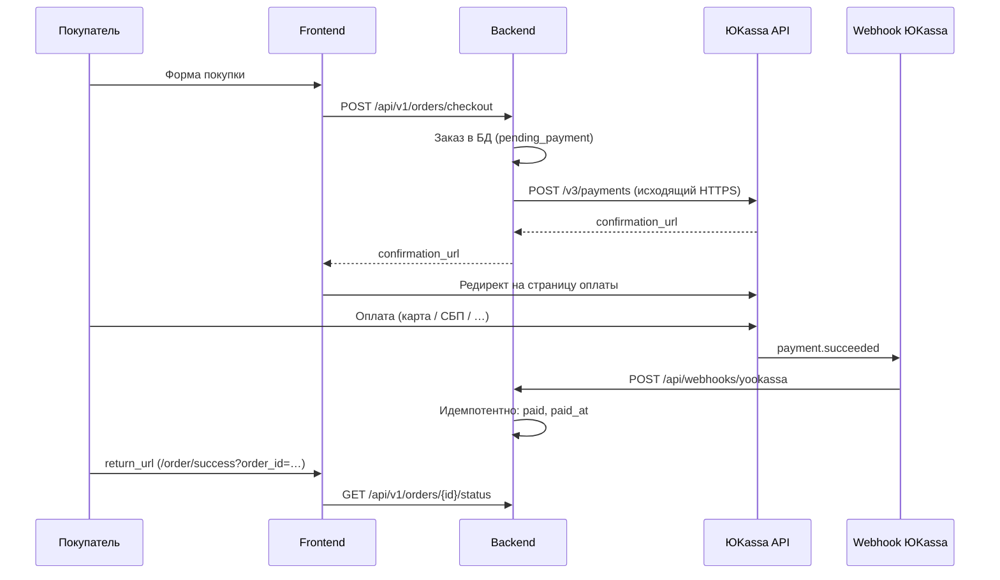

# Оплата (ЮKassa) на сервере

Инструкция только для платёжной системы. Деплой на VPS — [SERVER_DEPLOY_DE.md](SERVER_DEPLOY_DE.md). Локальная разработка — [LOCAL_SETUP.md](LOCAL_SETUP.md).

---

## Нужен ли ngrok на сервере?

**Нет.** Ngrok — обходной путь для **локальной** разработки: ЮKassa не может отправить webhook на `localhost` или приватный IP.

На сервере в Германии (или в Москве) с **публичным IP** и **HTTPS-доменом** webhook приходит напрямую:

```
ЮKassa → https://ваш-домен/api/webhooks/yookassa → nginx → backend :8000
```

Ngrok на VPS **не ставьте** и в `.env` **не прописывайте** — ничего «автоматически» не подтянется, но и туннель не нужен.


| Среда                      | Ngrok                                       |
| -------------------------- | ------------------------------------------- |
| Локально (Windows)         | Да, см. [LOCAL_SETUP.md §7](LOCAL_SETUP.md) |
| VPS с публичным IP + домен | Нет                                         |


---

## Как это работает




### Что делает backend

1. `**POST /api/v1/orders/checkout**` — создаёт заказ в PostgreSQL, вызывает [ЮKassa API](https://api.yookassa.ru/v3/payments), сохраняет `provider_payment_id` и `confirmation_url`.
2. Пользователь платит на стороне ЮKassa (редирект).
3. `**POST /api/webhooks/yookassa**` — ЮKassa шлёт событие `payment.succeeded`. Backend сохраняет сырое событие в `payment_webhook_events` (защита от повторов) и через `sp_apply_payment_succeeded` переводит заказ в `paid`.
4. `**GET /api/v1/orders/{order_id}/status**` — фронт проверяет оплату на странице «Спасибо».

### Что является «истиной» об оплате

- **Webhook** — единственный надёжный сигнал, что деньги пришли. Пользователь может закрыть вкладку до `return_url`.
- `**return_url`** — только UX (страница успеха), не подтверждение платежа.

Код: `backend/app/services/orders.py`, `backend/app/api/routes/webhooks.py`, `backend/app/services/yookassa.py`.

---

## Что требуется

### Сеть и порты


| Направление   | Порт            | Назначение                                             |
| ------------- | --------------- | ------------------------------------------------------ |
| **Входящий**  | **443** (HTTPS) | Webhook ЮKassa, `return_url`, checkout с фронта        |
| Входящий      | 80              | Редирект на HTTPS, выпуск сертификата Let's Encrypt    |
| Внутренний    | 8000            | Uvicorn/FastAPI (за nginx, наружу не открывать)        |
| **Исходящий** | **443**         | Backend → `https://api.yookassa.ru` (создание платежа) |


**Firewall (ufw):** откройте `80/tcp` и `443/tcp`. Порт `8000` с интернета закрыт — к нему ходит только nginx на `127.0.0.1`.

Проверка исходящего доступа с сервера:

```bash
curl -sI https://api.yookassa.ru/v3/payments | head -1
# ожидается HTTP/2 401 или 405 — главное, что соединение есть
```

### HTTPS и домен

ЮKassa в боевом режиме принимает webhook только на **публичный HTTPS-URL**. Голый IP без сертификата — плохой вариант.

Нужно:

1. Домен (или поддомен), A-запись → публичный IP сервера.
2. TLS-сертификат (Let's Encrypt / certbot).
3. Nginx (или аналог), который проксирует `/api/` на backend — пример: [deploy/nginx/qr-pamyat.conf](../deploy/nginx/qr-pamyat.conf).

Webhook URL в личном кабинете ЮKassa:

```text
https://<ваш-домен>/api/webhooks/yookassa
```

Проверка снаружи:

```bash
curl -s https://<ваш-домен>/api/v1/health
```

### Переменные окружения (`.env`)

```env
# Обязательно для оплаты
YOOKASSA_SHOP_ID=       # shopId из ЛК ЮKassa
YOOKASSA_SECRET_KEY=    # секретный ключ

# URL страницы «Спасибо» после оплаты (ваш фронт, HTTPS)
YOOKASSA_RETURN_URL=https://<ваш-домен>/order/success

# Зарезервировано, в коде пока не используется
YOOKASSA_WEBHOOK_SECRET=
```

Минимум для работы checkout: `**YOOKASSA_SHOP_ID**` и `**YOOKASSA_SECRET_KEY**`. Без них API ответит `503 YOOKASSA_NOT_CONFIGURED`.

`YOOKASSA_RETURN_URL` должен совпадать с реальным адресом фронта на этом сервере (не `127.0.0.1`). Backend сам добавляет `?order_id=<uuid>`.

### Личный кабинет ЮKassa

1. **Тестовый магазин** — для отладки на немецком VPS (карты из [документации ЮKassa](https://yookassa.ru/developers/payment-acceptance/testing-and-going-live/testing)).
2. **Боевой магазин** — после подключения ИП/ООО и модерации (см. юридический блок ниже).

В настройках HTTP-уведомлений:


| Поле    | Значение                                                                         |
| ------- | -------------------------------------------------------------------------------- |
| URL     | `https://<ваш-домен>/api/webhooks/yookassa`                                      |
| События | как минимум `payment.succeeded` (остальные можно включить — лишние игнорируются) |


После смены домена (Германия → Москва) **обязательно обновите URL** в ЛК ЮKassa и `YOOKASSA_RETURN_URL` в `.env`.

### База данных

Таблицы `payments`, `payment_webhook_events` и процедуры (`sp_record_payment`, `sp_apply_payment_succeeded`, …) должны быть развёрнуты скриптами из `db/scripts/`. Без БД webhook сохранится с ошибкой, заказ не перейдёт в `paid`.

### Права и секреты

- `YOOKASSA_SECRET_KEY` — только на сервере в `.env`, не в git, не на фронте.
- Файл `.env` — права `600`, владелец — пользователь, под которым крутится backend.
- Webhook-эндпоинт **без JWT** (так задумано): ЮKassa шлёт POST напрямую. Защита — идемпотентность по `provider_event_id` в БД.

---

## Настройка на сервере (Германия, этап разработки/стейдж)

Пошагово — только оплата.

### 1. Домен и HTTPS

```bash
# Пример: поддомен staging.example.de → IP VPS
sudo apt install nginx certbot python3-certbot-nginx
sudo certbot --nginx -d staging.example.de
```

Скопируйте и адаптируйте [deploy/nginx/qr-pamyat.conf](../deploy/nginx/qr-pamyat.conf): `server_name`, пути к сертификатам, `proxy_pass` на `127.0.0.1:8000`.

### 2. Backend запущен и слушает :8000

```bash
# из корня проекта, с активированным venv
cd backend
uvicorn app.main:app --host 0.0.0.0 --port 8000
# в проде — systemd/supervisor/docker, главное чтобы nginx достучался
```

### 3. `.env` на сервере

```env
YOOKASSA_SHOP_ID=<тестовый shopId>
YOOKASSA_SECRET_KEY=<тестовый secret>
YOOKASSA_RETURN_URL=https://staging.example.de/order/success
```

Перезапустите backend после изменения `.env`.

### 4. Webhook в ЮKassa

В [личном кабинете](https://yookassa.ru/my) → Настройки → HTTP-уведомления:

```text
https://staging.example.de/api/webhooks/yookassa
```

### 5. Проверка end-to-end

1. Откройте сайт по HTTPS, оформите тестовый заказ.
2. Оплатите тестовой картой ЮKassa.
3. В БД: заказ `paid`, платёж `succeeded`, запись в `payment_webhook_events` с `processed_at`.
4. Страница `/order/success?order_id=…` показывает успех (`is_paid: true`).

Логи backend при webhook: входящий POST на `/api/webhooks/yookassa`, без 4xx/5xx.

---

## Перенос на московский сервер

Меняется инфраструктура, **логика оплаты та же**, ngrok по-прежнему не нужен.


| Что обновить | Действие                                                     |
| ------------ | ------------------------------------------------------------ |
| DNS          | A-запись прод-домена (например `qr-pamyat.ru`) → IP в Москве |
| TLS          | Новый certbot на московском nginx                            |
| `.env`       | `YOOKASSA_RETURN_URL=https://qr-pamyat.ru/order/success`     |
| ЛК ЮKassa    | Webhook → `https://qr-pamyat.ru/api/webhooks/yookassa`       |
| Ключи        | Тестовые → боевые `shopId` / `secretKey` при выходе в прод   |
| Firewall     | Снова только 80/443 снаружи                                  |


Два сервера одновременно с одним магазином ЮKassa — неудобно: webhook может указывать только на один URL. На время миграции либо один активный стенд, либо два разных магазина (тест + прод).

---

## Юридические и организационные аспекты (кратко)

Это не юридическая консультация — чеклист перед **боевыми** платежами в РФ.


| Требование                                       | Зачем                                                                                                                                                                                                     |
| ------------------------------------------------ | --------------------------------------------------------------------------------------------------------------------------------------------------------------------------------------------------------- |
| **ИП или ООО** + расчётный счёт                  | Подключение боевого магазина ЮKassa                                                                                                                                                                       |
| **Договор с ЮKassa / эквайринг**                 | Приём карт и СБП от физлиц                                                                                                                                                                                |
| **Оферта, политика конфиденциальности** на сайте | Модерация магазина, 152-ФЗ                                                                                                                                                                                |
| **54-ФЗ (онлайн-касса)**                         | Фискальные чеки покупателю; в ЮKassa — «Чеки от ЮKassa». В текущем коде поле `receipt` в платеже **ещё не передаётся** — для прода его нужно добавить                                                     |
| **152-ФЗ**                                       | Персональные данные покупателей (email, телефон, ФИО усопшего). Хранение на сервере в Германии для **российских** клиентов может требовать отдельной оценки (локализация ПДн с 2025 — уточняйте у юриста) |
| **Валюта**                                       | Только RUB, как в коде                                                                                                                                                                                    |


Тестовый магазин на немецком VPS для разработки **юридически не принимает реальные деньги** — это нормальный сценарий отладки.

---

## Частые проблемы


| Симптом                                | Причина                        | Решение                                                             |
| -------------------------------------- | ------------------------------ | ------------------------------------------------------------------- |
| `YOOKASSA_NOT_CONFIGURED`              | Пустые ключи в `.env`          | Заполнить `YOOKASSA_SHOP_ID`, `YOOKASSA_SECRET_KEY`, перезапуск API |
| Оплата прошла, заказ `pending_payment` | Webhook не дошёл               | URL в ЛК ЮKassa, HTTPS, nginx `/api/`, firewall 443                 |
| `502 YOOKASSA_ERROR`                   | Нет исходящего HTTPS к API     | Проверить `curl https://api.yookassa.ru`, ключи, тест/боевой режим  |
| Успех на ЮKassa, но не на сайте        | Неверный `YOOKASSA_RETURN_URL` | Должен быть HTTPS-адрес **вашего** фронта                           |
| Дубли webhook                          | Норма                          | Идемпотентность в `payment_webhook_events` — повтор игнорируется    |


---

## Сравнение: локально vs сервер


|                       | Локально + ngrok                                 | VPS (Германия / Москва)                 |
| --------------------- | ------------------------------------------------ | --------------------------------------- |
| Webhook URL           | `https://….ngrok-free.app/api/webhooks/yookassa` | `https://<домен>/api/webhooks/yookassa` |
| Меняется при рестарте | Да (бесплатный ngrok)                            | Нет (стабильный домен)                  |
| HTTPS                 | Через ngrok                                      | certbot + nginx                         |
| Ngrok                 | Обязателен                                       | **Не нужен**                            |


Подробности ngrok для локальной машины: [LOCAL_SETUP.md §7](LOCAL_SETUP.md).